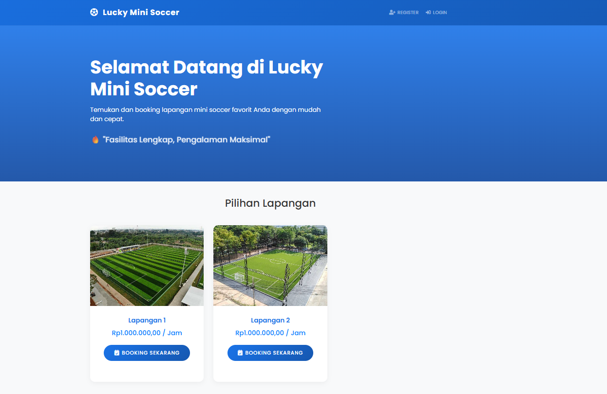
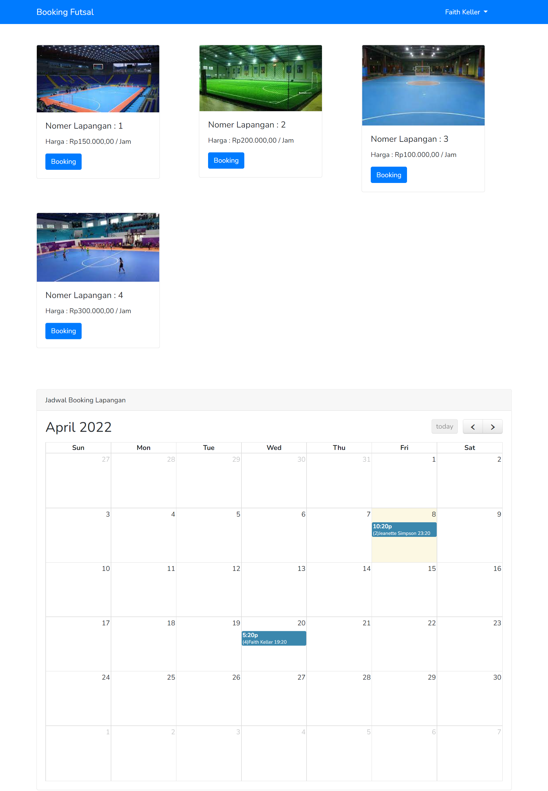

# Lucky Mini Soccer - Web Booking Lapangan Mini Soccer

Aplikasi web untuk booking lapangan mini soccer berbasis Laravel 8, dengan dashboard admin menggunakan SB Admin 2.

---

## Daftar Isi

- [Screenshots](#screenshots)
- [Fitur](#fitur)
- [Struktur Direktori](#struktur-direktori)
- [Instalasi & Menjalankan Project](#instalasi--menjalankan-project)
- [Database](#database)
- [Testing](#testing)
- [Template Admin](#template-admin)
- [Konfigurasi Lain](#konfigurasi-lain)
- [Lisensi](#lisensi)

---

## Screenshots




---

## Fitur

- Booking lapangan mini soccer secara online
- Manajemen user (register, login)
- Daftar harga dan pilihan lapangan
- Seeder & migrasi database otomatis
- Responsive design
- Dashboard admin berbasis SB Admin 2

---

## Struktur Direktori

```
.
├── app/                  # Kode utama aplikasi Laravel
├── bootstrap/            # Bootstrap file Laravel
├── config/               # Konfigurasi aplikasi
├── database/             # Seeder, migrasi, dan file SQL
├── node_modules/         # Dependency Node.js
├── public/               # Aset publik (gambar, video, dll)
│   ├── screenshots/      # Gambar screenshot aplikasi
│   └── backend/          # Template SB Admin 2 & README-nya
├── resources/            # View, asset, dan file resource lainnya
├── routes/               # Routing aplikasi
├── storage/              # File storage Laravel
├── tests/                # Unit & feature tests
├── vendor/               # Dependency Composer
├── .editorconfig
├── .gitattributes
├── .gitignore
├── .styleci.yml
├── artisan
├── composer.json
├── composer.lock
├── minsoc.sql
├── package.json
├── package-lock.json
├── phpunit.xml
├── preview.png
├── README.md
├── server.php
├── webpack.mix.js
```

---

## Instalasi & Menjalankan Project

1. **Clone repository**
    ```bash
    git clone https://github.com/abdulaziz-m5u/Futsal-web-application.git project-name
    cd project-name
    ```

2. **Install dependency**
    ```bash
    composer install
    npm install
    ```

3. **Copy file environment**
    ```bash
    cp .env.example .env
    ```

4. **Generate key & migrate database**
    ```bash
    php artisan key:generate
    php artisan migrate:fresh --seed
    ```

5. **Jalankan server**
    ```bash
    php artisan serve
    ```

---

## Database

- File SQL: `minsoc.sql`
- Seeder & migrasi otomatis tersedia

---

## Testing

Jalankan unit test:
```bash
php artisan test
```

---

## Template Admin

Template admin menggunakan [SB Admin 2](https://startbootstrap.com/theme/sb-admin-2/).  
Lihat dokumentasi tambahan di `public/backend/README.md` untuk detail penggunaan dan pengembangan dashboard.

---

## Konfigurasi Lain

- Konfigurasi Webpack: `webpack.mix.js`
- Konfigurasi StyleCI: `.styleci.yml`
- Konfigurasi PHPUnit: `phpunit.xml`

---

## Lisensi

Project ini menggunakan lisensi open source (MIT).  
Template SB Admin 2 juga berlisensi MIT.
